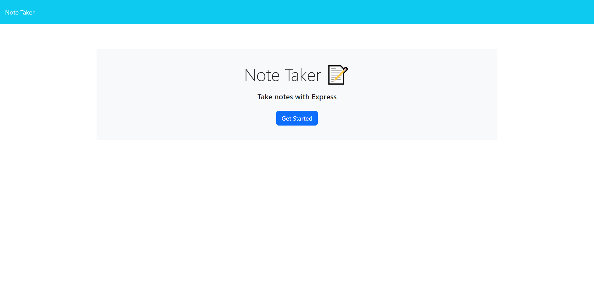
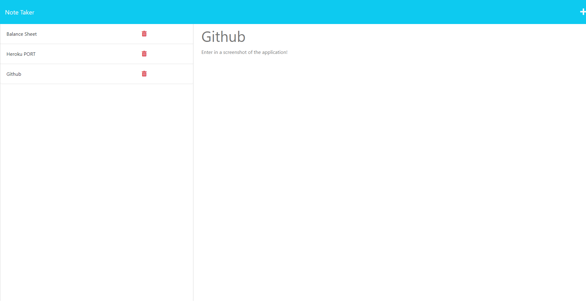

# express-note-taker

## Description

To allow myself to take notes of the day while programming. Allowing me to look back and reflect on what I could have done better. with this application I was able to implement Modular Routing, GET, POST, DELETE requests, Express, and heroku deployment. 

## Table of Contents 

- [User Story](#user-story)
- [Acceptance Criteria](#acceptance-criteria)
- [Installation](#installation)
- [Usage](#usage)
- [Credits](#credits)
- [License](#license)

## User Story
AS A small business owner  
I WANT to be able to write and save notes  
SO THAT I can organize my thoughts and keep track of tasks I need to complete  

## Acceptance Criteria
GIVEN a note-taking application  
WHEN I open the Note Taker  
THEN I am presented with a landing page with a link to a notes page  
WHEN I click on the link to the notes page  
THEN I am presented with a page with existing notes listed in the left-hand column, plus empty fields to enter a new note title and the note’s text in the right-hand column  
WHEN I enter a new note title and the note’s text  
THEN a Save icon appears in the navigation at the top of the page  
WHEN I click on the Save icon  
THEN the new note I have entered is saved and appears in the left-hand column with the other existing notes  
WHEN I click on an existing note in the list in the left-hand column  
THEN that note appears in the right-hand column  
WHEN I click on the Write icon in the navigation at the top of the page  
THEN I am presented with empty fields to enter a new note title and the note’s text in the right-hand column  

## Installation

  Local -
  Clone - git clone git@github.com:KevinRhode/svg-logo-gen.git  
  Node.js - Verison 16.18.0  
  [DownloadLinks](https://nodejs.org/download/release/v16.18.0/)  
  Install Node.js, once done move onto next
  Navigate to index.js file location in terminal  
  npm - npm install  

## Usage
 
  [Link to Deployed Application](https://express-note-taker-kevinrhode.herokuapp.com/)  

Landing Page:

What you should see when Get started is Pressed:
  

## Credits

[Starter Code for Deployment](https://github.com/coding-boot-camp/miniature-eureka)  

## License

MIT License - https://choosealicense.com/licenses/mit/
